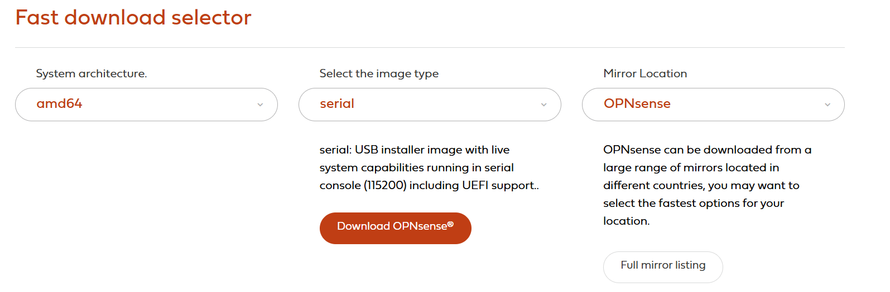
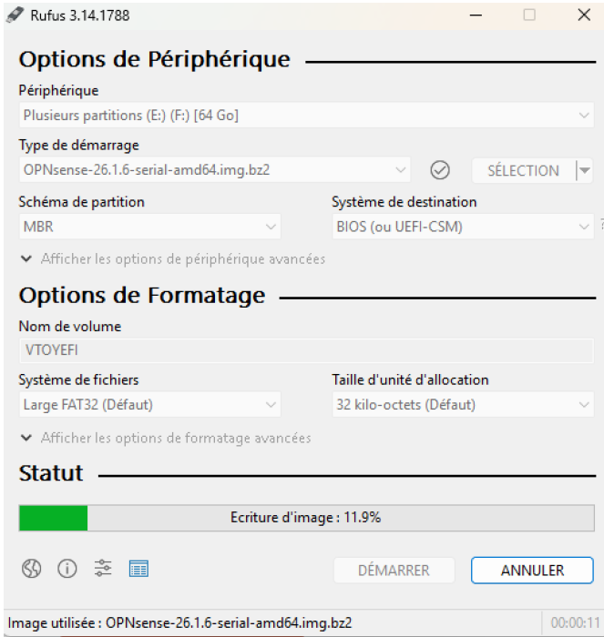
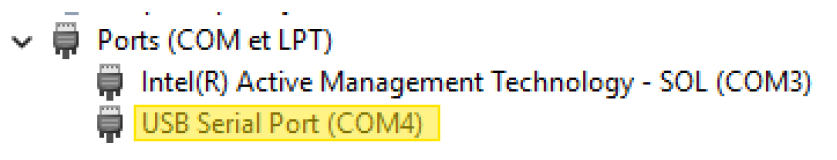
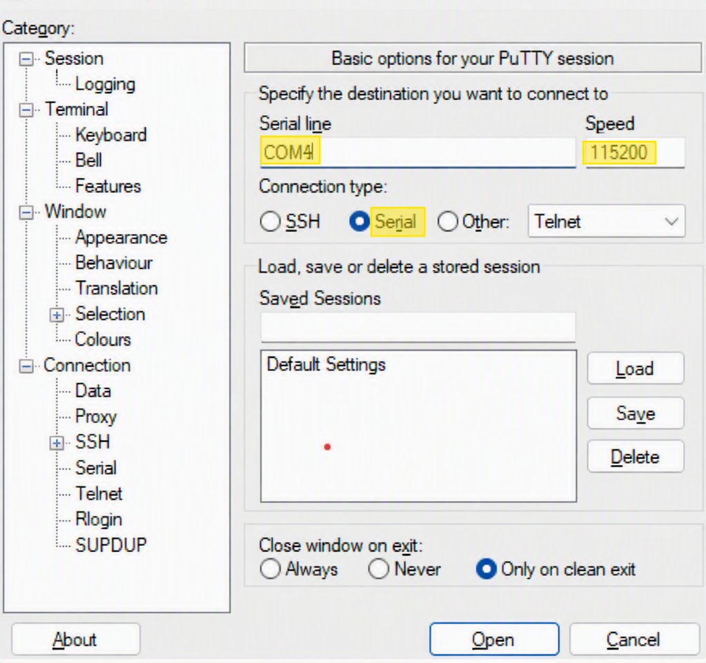
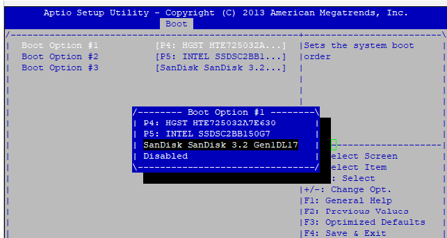

# Installation et configuration initiale d'un pare-feu OPNsense

## Contexte

Ce projet consiste à transformer une appliance réseau **Riverbed** (matériel récupéré, initialement destiné à un tout autre usage) en un pare-feu opérationnel grâce à la distribution open-source **OPNsense**, basée sur FreeBSD.

## Objectifs

À l'issue de ce projet, le pare-feu doit être pleinement opérationnel avec :
- Une interface **WAN** connectée à Internet (`igb5`) configurée en DHCP
- Une interface **LAN** (`igb4`) avec une adresse IP statique (`192.168.6.254/24`)
- Un accès fonctionnel à l'interface web d'administration

## Matériel et prérequis

- Appliance Riverbed avec accès console
- Câble console (RS-232/USB)
- Clé USB (64 Go minimum)
- PC équipé de Rufus et PuTTY
- Image ISO d'OPNsense (version amd64, format série)

## Déroulé

### 1. Préparation de la clé USB bootable

Téléchargement de l'image d'installation OPNsense au format série à ce lien https://opnsense.org/download/ (nécessaire car l'appliance ne dispose pas de sortie vidéo, uniquement d'un accès console série) 



Et gravure sur clé USB avec **Rufus** en appliquant les paramètres suivants :

```text
- Périphérique : Sélectionner la clé USB cible
- Type de démarrage : Sélectionner l'image OPNsense téléchargée
- Schéma de partition : MBR
- Système de destination : BIOS (ou UEFI-CSM)
```

<!-- 📸 Capture à insérer ici : fenêtre Rufus pendant/avant la gravure de la clé USB -->



### 2. Connexion console au Riverbed

Identification du port COM associé à la clé USB via le Gestionnaire de périphériques Windows.

, 

Puis configuration d'une session série dans **PuTTY** :

- Connection type : `Serial`
- Serial line : `COM4` *(port identifié précédemment)*
- Speed : `115200` bauds

<!-- 📸 Capture à insérer ici : fenêtre de configuration PuTTY (mode Serial, 115200 bauds) -->
, 

### 3. Démarrage sur la clé USB

#### 3.1 Accès au BIOS
* Éteindre l'appliance Riverbed.
* Le redémarrer et appuyer immédiatement sur la touche **Suppr** (ou Del) pour accéder au BIOS (Aptio Setup Utility).

#### 3.2 Modification de l'ordre de démarrage
Accès au BIOS (Aptio Setup Utility) de l'appliance et modification de l'ordre de démarrage pour placer la clé USB en priorité, afin de lancer l'installateur OPNsense.

<!-- 📸 Capture à insérer ici : écran BIOS avec l'ordre de démarrage (clé USB en premier) -->


---

### 4. Installation du système

Installation en format **ZFS** (GPT/UEFI Hybrid, configuration Stripe sans redondance) sur le disque interne de l'appliance, avec destruction du contenu existant.

<!-- 📸 Capture à insérer ici : écran de progression de l'installation OPNsense -->


### 5. Configuration initiale via la console

Une fois le système installé et redémarré, configuration en ligne de commande :

**Assignation des interfaces (menu console, option 1)** :
```
Do you want to configure LAGGs now? [y/N]: n
Do you want to configure VLANs now? [y/N]: n
Enter the WAN interface name or 'a' for auto-detection: igb5
Enter the LAN interface name or 'a' for auto-detection: igb4
Enter the Optional interface 1 name (or nothing if finished): [Entrée]
Do you want to proceed? [y/N]: y
```

**Configuration IP du WAN (option 2, interface 2)** :
- IPv4 via DHCP : `y`
- IPv6 via DHCP6 : `y`
- Activer l'interface web (passage HTTPS → HTTP) : `y`

**Configuration IP du LAN (option 2, interface 1)** :
- IPv4 via DHCP : `n`
- Adresse IPv4 statique : `192.168.6.254`
- Masque de sous-réseau (bit count, notation CIDR) : `24`
- Passerelle : laissée vide (interface LAN)
- IPv6 : `n`
- Serveur DHCP sur le LAN : `n`
- Restaurer les accès GUI par défaut : `y`

À l'issue de cette étape, la console confirme l'accès à l'interface web via `http://192.168.6.254`.

<!-- 📸 Capture à insérer ici : terminal console listant les IP WAN/LAN confirmées -->


### 6. Accès à l'interface web

Configuration manuelle de la carte réseau du PC de test (`192.168.6.2/24`, passerelle `192.168.6.254`), vérification de la connectivité par `ping`, puis connexion à l'interface d'administration via `http://192.168.6.254`.

<!-- 📸 Capture à insérer ici : tableau de bord OPNsense après connexion réussie -->


## Résultat

Le pare-feu est opérationnel :
- Interface WAN (`igb5`) : adresse DHCP attribuée automatiquement
- Interface LAN (`igb4`) : adresse statique `192.168.6.254/24`
- Interface web accessible depuis le réseau LAN

## Difficultés rencontrées

L'absence de sortie vidéo sur l'appliance Riverbed impose de travailler exclusivement en ligne de commande via une console série — une contrainte formatrice pour se familiariser avec l'administration bas niveau d'un équipement réseau, sans interface graphique.

## Compétences mobilisées

- Administration système en ligne de commande (console série)
- Installation et configuration d'un système FreeBSD/OPNsense
- Configuration réseau (interfaces, adressage IP statique/DHCP)
- Utilisation d'outils d'administration à distance (PuTTY, Rufus)
