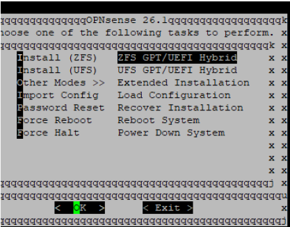
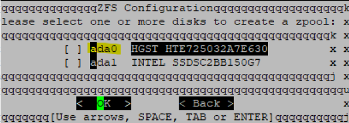
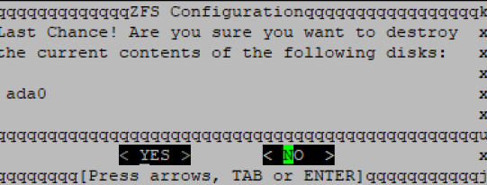
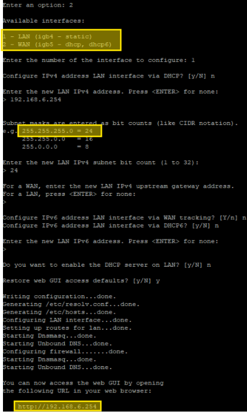
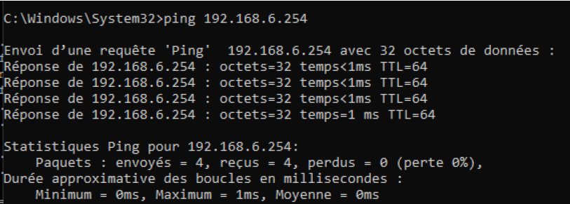
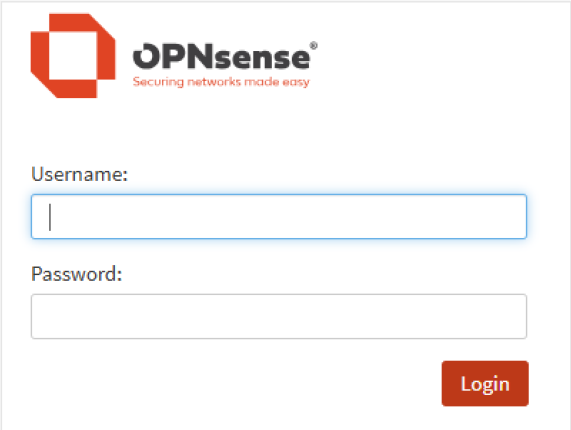
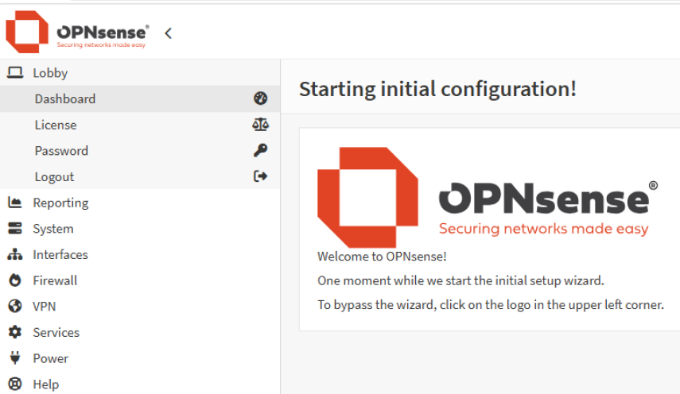

# Installation et configuration initiale d'un pare-feu OPNsense

## Contexte

Ce projet consiste à transformer une appliance réseau **Riverbed** (matériel récupéré, initialement destiné à un tout autre usage) en un pare-feu opérationnel grâce à la distribution open-source **OPNsense**, basée sur FreeBSD.

## Objectifs

À l'issue de ce projet, le pare-feu doit être pleinement opérationnel avec :
- Une interface **WAN** connectée à Internet (`igb5`) configurée en DHCP
- Une interface **LAN** (`igb4`) avec une adresse IP statique (`192.168.6.254/24`)
- Un accès fonctionnel à l'interface web d'administration

## Matériel et prérequis

- Appliance Riverbed avec accès console
- Câble console (RS-232/USB)
- Clé USB (64 Go minimum)
- PC équipé de Rufus et PuTTY
- Image ISO d'OPNsense (version amd64, format série)

## Déroulé

### 1. Préparation de la clé USB bootable

Téléchargement de l'image d'installation OPNsense au format série à ce lien https://opnsense.org/download/ (nécessaire car l'appliance ne dispose pas de sortie vidéo, uniquement d'un accès console série) 


Et gravure sur clé USB avec **Rufus** en appliquant les paramètres suivants :

```text
- Périphérique : Sélectionner la clé USB cible
- Type de démarrage : Sélectionner l'image OPNsense téléchargée
- Schéma de partition : MBR
- Système de destination : BIOS (ou UEFI-CSM)
```

<!-- 📸 Capture à insérer ici : fenêtre Rufus pendant/avant la gravure de la clé USB -->


### 2. Connexion console au Riverbed

Identification du port COM associé à la clé USB via le Gestionnaire de périphériques Windows.

, 

Puis configuration d'une session série dans **PuTTY** :

- Connection type : `Serial`
- Serial line : `COM4` *(port identifié précédemment)*
- Speed : `115200` bauds

<!-- 📸 Capture à insérer ici : fenêtre de configuration PuTTY (mode Serial, 115200 bauds) -->
, 

---

### 3. Démarrage sur la clé USB

#### 3.1 Accès au BIOS
* Éteindre l'appliance Riverbed.
* Le redémarrer et appuyer immédiatement sur la touche **Suppr** (ou Del) pour accéder au BIOS (Aptio Setup Utility).

#### 3.2 Modification de l'ordre de démarrage
Dans l'onglet **Boot**, modifier l'ordre pour placer la clé USB (SanDisk) en position **Boot Option #1** pour lancer l'installateur OPNsense au redémarrage suivant.


Puis Aller dans l'onglet **Save & Exit**, sélectionner **Save Changes and Exit** et valider. L'appareil redémarre alors sur la clé USB.

---

### 4. Installation du système

Installation en format **ZFS** (GPT/UEFI Hybrid, configuration Stripe sans redondance) sur le disque interne de l'appliance, avec destruction du contenu existant.
### Étapes de configuration
Sélectionnez les options suivantes dans l'installeur :

1. **Choix du type d'installation :** Sélectionnez `Install (ZFS) - ZFS GPT/UEFI Hybrid`.

   

   > **Configuration du ZFS :** Laissez l'option par défaut sur `Stripe - No Redundancy`.

2. **Sélection du disque :** Cochez la case correspondant au disque interne `ada0`.

   

3. **Confirmation finale :** Lorsque l'avertissement "Last Chance!" s'affiche, sélectionnez `YES` pour confirmer l'effacement du disque et démarrer l'installation.

   

### Finalisation
Une fois le processus lancé, attendez la fin de la copie des fichiers. L'installeur vous demandera ensuite de redémarrer le système pour finaliser l'installation.

> [!NOTE]
> Retirer la clé USB d'installation après le premier redémarrage pour que le système démarre sur le nouveau disque interne.
---

### 5. Configuration initiale via la console

Une fois le système installé et redémarré, configuration en ligne de commande :

Connexion à la console avec les identifiants par défaut pour accéder au menu de gestion :

* **Login** : `root`
* **Mot de passe** : `opnsense`

**5.1 Assignation des interfaces (menu console, option 1)** :
```
Do you want to configure LAGGs now? [y/N]: n
Do you want to configure VLANs now? [y/N]: n
Enter the WAN interface name or 'a' for auto-detection: igb5
Enter the LAN interface name or 'a' for auto-detection: igb4
Enter the Optional interface 1 name (or nothing if finished): [Entrée]
Do you want to proceed? [y/N]: y
```

> [!IMPORTANT]
Ces configurations associent nos ports réseau physiques (`igb5` pour Internet et `igb4` pour le réseau local) tout en sautant les options avancées comme les VLANs pour aller au plus simple.

### 5.2 Configuration des adresses IP (Option 2)
Cette étape définit l'identité réseau et les protocoles de communication du pare-feu.

```text
# Configuration WAN
IPv4 via DHCP: y
IPv6 via DHCP6: y
Reconfigure web GUI HTTP access: y

# Configuration LAN
IPv4 address: 192.168.6.254
IPv4 subnet bit count: 24
IPv4 upstream gateway: [Entrée]
IPv6 address: [Entrée]
Enable DHCP server on LAN: n
Restore web GUI access defaults: y
```

> [!IMPORTANT] 
> En résumé, voici ce que font ces configurations d'adresses IP :
>* **Pour le WAN (Internet)** : On demande au pare-feu de récupérer automatiquement une adresse IP et on active l'accès web en HTTP pour éviter les problèmes de certificats au début.
> * **Pour le LAN (Réseau local)** : On fixe l'adresse IP du pare-feu à `192.168.6.254` pour qu'il serve de passerelle stable aux machines, on laisse le serveur DHCP désactivé pour le configurer plus tard via le web, et on s'assure de garder l'accès à l'interface d'administration.



> [!NOTE]
> Une fois ces étapes validées, la console confirme la fin de la configuration. On peut désormais accéder à l'interface d'administration depuis notre navigateur via : `http://192.168.6.254`.

---

### 6. Accès à l'interface web

* **Étape 1 : Configuration du PC de test**
  * Configurer manuellement la carte réseau avec une adresse IP fixe : `192.168.6.2/24`
  * Définir la passerelle sur l'adresse du pare-feu : `192.168.6.254`

* **Étape 2 : Vérification de la connectivité**
  * Tester la liaison réseau à l'aide d'un `ping` vers le pare-feu.

   

* **Étape 3 : Connexion à l'administration**
  * Ouvrir le navigateur et se connecter à l'interface d'administration via : `http://192.168.6.254`

   
   
   


## Résultat

Le pare-feu est opérationnel :
- Interface WAN (`igb5`) : adresse DHCP attribuée automatiquement
- Interface LAN (`igb4`) : adresse statique `192.168.6.254/24`
- Interface web accessible depuis le réseau LAN

## Difficultés rencontrées

L'absence de sortie vidéo sur l'appliance Riverbed impose de travailler exclusivement en ligne de commande via une console série — une contrainte formatrice pour se familiariser avec l'administration bas niveau d'un équipement réseau, sans interface graphique.

## Compétences mobilisées

- Administration système en ligne de commande (console série)
- Installation et configuration d'un système FreeBSD/OPNsense
- Configuration réseau (interfaces, adressage IP statique/DHCP)
- Utilisation d'outils d'administration à distance (PuTTY, Rufus)
