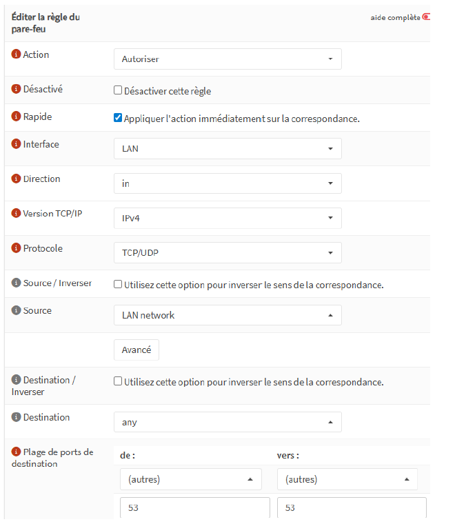
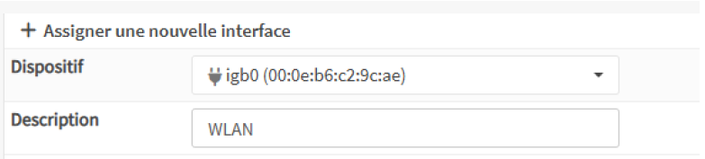
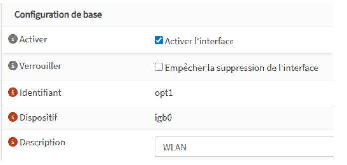
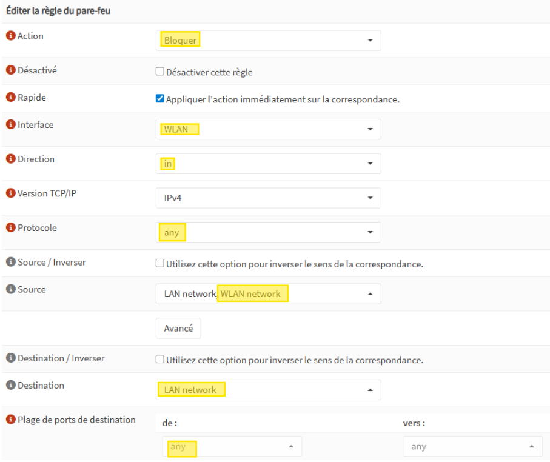
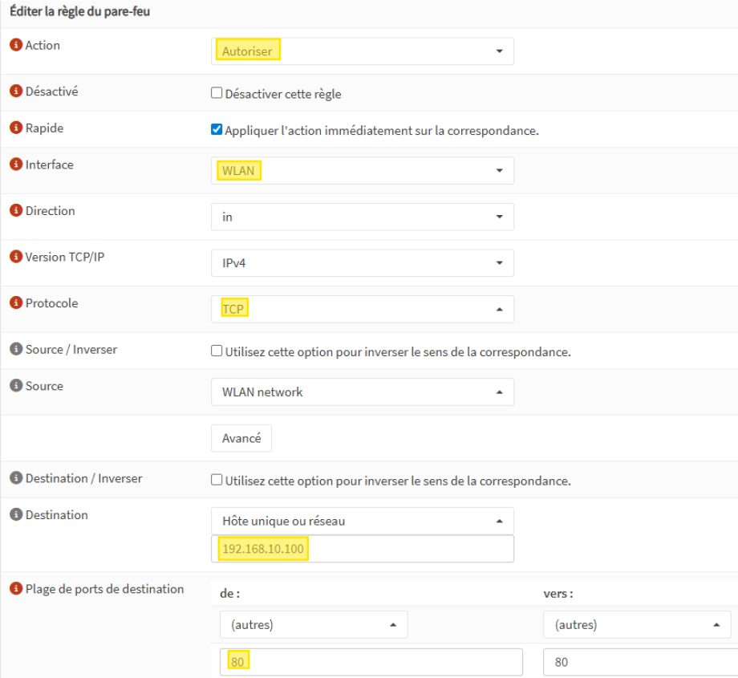

# Configuration des règles de filtrage sur un pare-feu OPNsense

## Contexte

Ce projet fait suite à l'installation initiale d'OPNsense sur l'appliance Riverbed. L'objectif est ici de configurer les **règles de pare-feu** via l'interface web, afin de maîtriser le filtrage du trafic entre deux réseaux distincts : un réseau filaire (LAN) et un réseau Wi-Fi (WLAN), moins sécurisé par nature.

## Principe fondamental

Dans OPNsense, les règles de filtrage sont évaluées **de haut en bas** sur l'interface d'entrée du trafic, et la première règle qui correspond à un paquet s'applique. Il est donc essentiel de respecter un ordre logique : les autorisations spécifiques en premier, les blocages généraux ensuite.

> Une règle se place toujours sur l'interface par laquelle le trafic **entre** dans le pare-feu : une règle sur l'interface LAN filtre le trafic provenant du LAN, une règle sur WLAN filtre le trafic provenant du Wi-Fi.

## Exercice 1 — Autoriser le port DNS (53) depuis le LAN

**Objectif** : N'autoriser depuis le LAN que le protocole DNS essentiel à la résolution de noms, tout le reste étant implicitement bloqué[cite: 1].

### Procédure de configuration
La règle doit être créée sur l'interface **LAN** (`Firewall → Rules → LAN`) avec les paramètres suivants[cite: 1] :
* **Action** : `Pass` (Autoriser)
* **Direction** : `in`
* **Source** : `LAN network`
* **Destination** : `any`
* **Port de destination** : `53` (TCP/UDP)

> [!IMPORTANT]
> **Pourquoi ne pas utiliser `any` comme port ?** Cela autoriserait l'intégralité du trafic et annulerait toute politique de sécurité. En appliquant le principe du moindre privilège, on n'ouvre que ce qui est strictement nécessaire.

### Aperçu de la configuration

## Exercice 2 — Bloquer l'accès du WLAN vers le LAN

**Objectif** : isoler totalement le réseau Wi-Fi du réseau filaire, pour empêcher les appareils WLAN d'accéder aux ressources internes (serveurs, postes, imprimantes).

### 1. Préparation de l'interface WLAN
Avant de configurer la règle de filtrage, l'interface doit être correctement assignée et activée dans OPNsense.

* **Assignation** : Allez dans `Interfaces → Assignments` pour ajouter la nouvelle interface réseau.

* **Activation et renommage** : 
    1. Cliquez sur le nom de la nouvelle interface (généralement `OPT1`).
    2. Cochez la case **Enable Interface**.
    3. Dans le champ **Description**, remplacez `OPT1` par `WLAN`.
       

**Paramètres de la règle** :

> ⚠ On bloque toujours le trafic indésirable sur l'interface d'entrée. Ici, c'est le WLAN qui initie le trafic : la règle intercepte donc les paquets dès leur arrivée sur cette interface, avant qu'ils ne puissent traverser le pare-feu.

## Exercice 3 — Autoriser l'accès à un serveur web spécifique depuis le WLAN

**Objectif** : permettre aux appareils du WLAN d'accéder à un serveur web précis (`192.168.10.100`) situé sur le LAN, sans remettre en cause le blocage global de l'exercice 2.

**Paramètres de la règle** (placée **au-dessus** de la règle de blocage pour être évaluée en priorité) :

> [!IMPORTANT]
> Cibler une IP unique est indispensable : indiquer `LAN net` comme destination aurait ouvert l'accès à l'ensemble du réseau local et annulé la règle de blocage.

## Exercice 4 — Autoriser l'accès à des imprimantes réseau depuis le WLAN

**Objectif** : permettre l'impression depuis le WLAN vers deux imprimantes du LAN (`192.168.10.50` et `192.168.10.51`), sans ouvrir l'accès au reste du réseau.

Plutôt que dupliquer une règle par imprimante, création d'un **alias** (`Firewall → Aliases`) regroupant les deux adresses IP :

| Champ de l'alias | Valeur |
|---|---|
| Nom | `Imprimantes_LAN` |
| Type | `Host(s)` |
| Contenu | `192.168.10.50`, `192.168.10.51` |

Puis création d'une règle unique sur l'interface WLAN ciblant cet alias comme destination :

| Champ de la règle | Valeur |
|---|---|
| Action | `Pass` |
| Interface | `WLAN` |
| Protocole | `TCP` (port 9100 ou IPP pour l'impression) |
| Source | `WLAN net` |
| Destination | `Imprimantes_LAN` (alias) |
| Port destination | `any` |

Cette approche simplifie la gestion et réduit le risque d'erreur en cas d'évolution du parc d'imprimantes.

<!-- 📸 Capture à insérer ici : formulaire de création de l'alias Imprimantes_LAN -->

<!-- 📸 Capture à insérer ici : formulaire de la règle WLAN vers l'alias imprimantes -->

## Résultat

Un modèle de segmentation réseau fonctionnel : le WLAN est isolé du LAN par défaut, avec des exceptions ciblées et documentées (serveur web, imprimantes), conformément au principe du moindre privilège.

## Compétences mobilisées

- Configuration de règles de pare-feu (Firewall Rules) sous OPNsense
- Compréhension de la logique d'évaluation séquentielle des règles
- Segmentation réseau et isolation Wi-Fi / filaire
- Création et utilisation d'alias pour la gestion d'IP multiples

---

